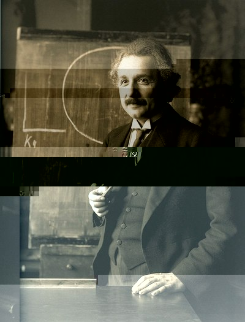
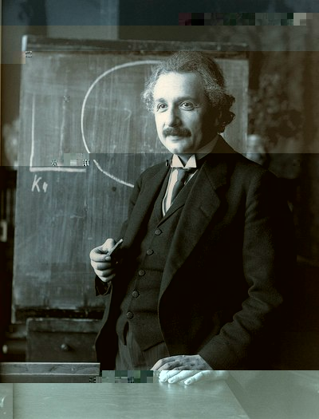

# Random JPG Glitcher
Randomly glitches JPGs (and other images) and saves output as image or video file

## install
```
pip install -r requirements.txt
```

## usage
```
% ./rjg.py --help

usage: rjg.py [-h] [--source SOURCE] {img,vid} ...

positional arguments:
  {img,vid}
    img            create image
    vid            create animationb

optional arguments:
  -h, --help       show this help message and exit
  --source SOURCE  source image file

examples:
  ./rjg.py img --nglitch=70
  ./rjg.py vid  --fps=8 --steps-per-round=10 
  ./rjg.py vid  --rounds=30 --steps-per-step=10
```
### usage: img
```
% ./rjg.py img --help

usage: rjg.py img [-h] [--nglitch NGLITCH]

optional arguments:
  -h, --help         show this help message and exit
  --nglitch NGLITCH  count or range of mutations per image. default: random
```

### usage: vid
```
% ./rjg.py vid --help

usage: rjg.py vid [-h] [--fps FPS] [--rounds ROUNDS]
                  [--steps-per-round STEPS_PER_ROUND]
                  [--glitch-per-step GLITCH_PER_STEP]

optional arguments:
  -h, --help            show this help message and exit
  --fps FPS             frames per second
  --rounds ROUNDS       rounds of seperate mutations
  --steps-per-round STEPS_PER_ROUND
                        mutation steps per round
  --glitch-per-step GLITCH_PER_STEP
                        number of mutations per step

```

## sample video output
```
./rjg.py vid --fps=4 --rounds=1 --steps-per-round=60 --glitch-per-step=1
```
[video (progressive)](https://raw.githubusercontent.com/zrthstr/random-jpg-glitcher/master/output/sample-progressive.mp4)


```
./rjg.py vid --fps=4 --rounds=15 --steps-per-round=6 --glitch-per-step=6
```
[video (sequential)](https://raw.githubusercontent.com/zrthstr/random-jpg-glitcher/master/output/sample-seqential.mp4)


## select source image
```
./rjg.py --source input/moonlanding.jpg img --nglitch 60
```


## sample image output
```
for e in $(seq 10); do ./rjg.py img ; done
```

 
 
 
 
 

## todo:
* fix:
```
WARNING:root:IMAGEIO FFMPEG_WRITER WARNING: input image is not divisible by macro_block_size=16, resizing from (525, 400) to (528, 400) to ensure video compatibility with most codecs and players. To prevent resizing, make your input image divisible by the macro_block_size or set the macro_block_size to None (risking incompatibility). You may also see a FFMPEG warning concerning speedloss due to data not being aligned.
```


